# Dashboard-App

Welcome to the Dashboard-App for therapists, an application designed to help you manage your patients and their progress.

## Overview

The Dashboard-App offers therapists a variety of features and tools to better support and care for their patients. It allows you to:

- Manage patient profiles and track their progress over time.
- Schedule sessions and appointments with your patients.
- Access notes and reports on patient progress.
- Share resources and exercises with your patients.

## Installation

To install the Dashboard-App on your device, please follow these steps:

1. Download the latest version of the app from the App Store.
2. Install the app on your device.
3. Open the app and follow the instructions to set up your account.

## Contributing

We welcome any contributions to the development of the Dashboard-App. If you are interested in helping us, you can:

- Review the source code and report any bugs or issues.
- Write code to add new features or improve existing ones.
- Share your experiences and suggestions for improving the app.

Please refer to our [Contribution Guidelines](CONTRIBUTING.md) for more information.

## Technologies Used

- Frontend: Flutter, Dart
- Backend: Node.js, Express
- Database: MongoDB
- Additional Technologies: ACM6, JavaScript

## Contact

If you have any questions, suggestions, or concerns, please do not hesitate to contact us. You can reach us by email at test@dashboard-app.com.

Thank you for your interest in the Dashboard-App and we wish you success in working with your patients!

## Screenshots

  
  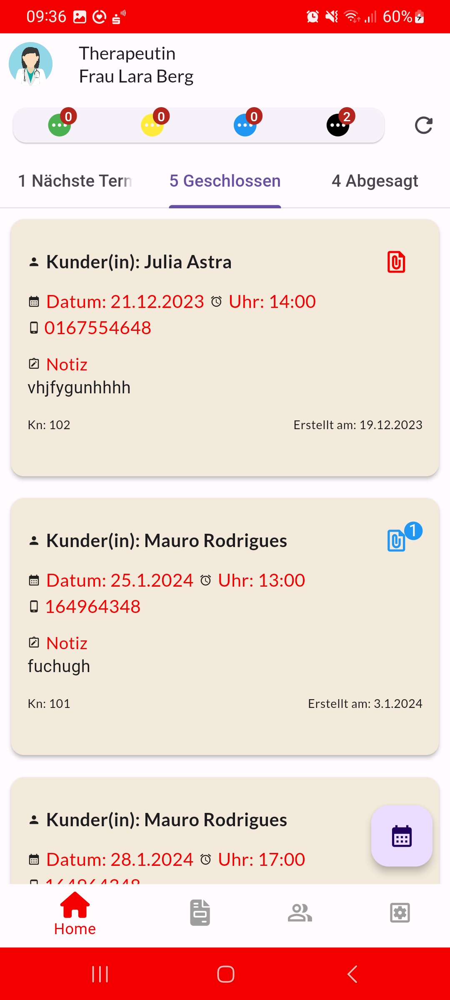
  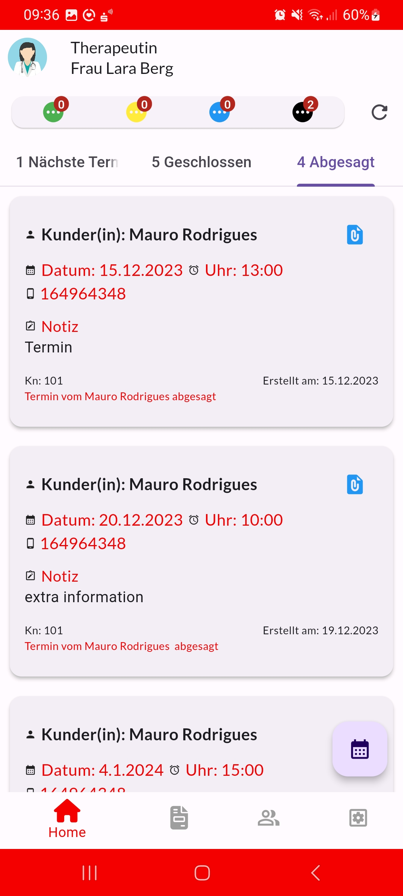
  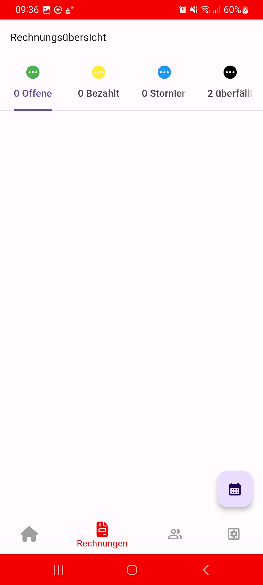
  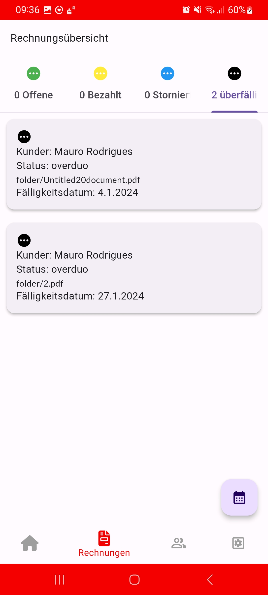
  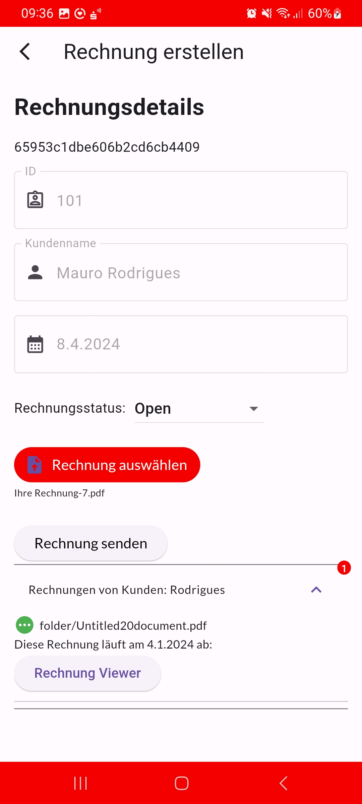
  
  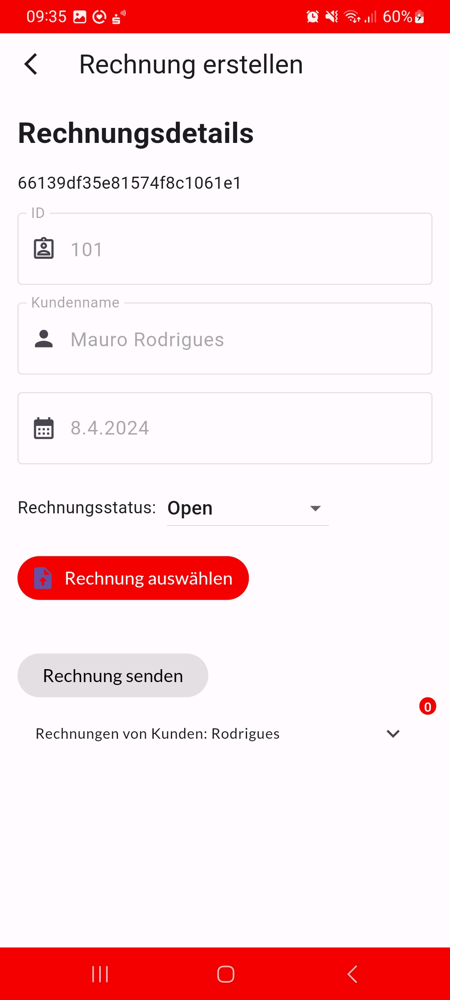
  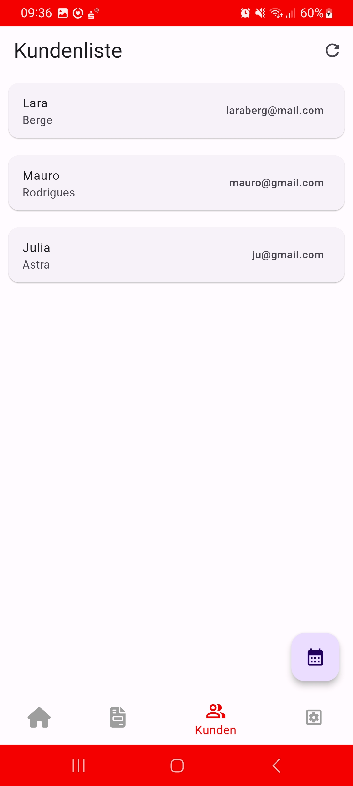
  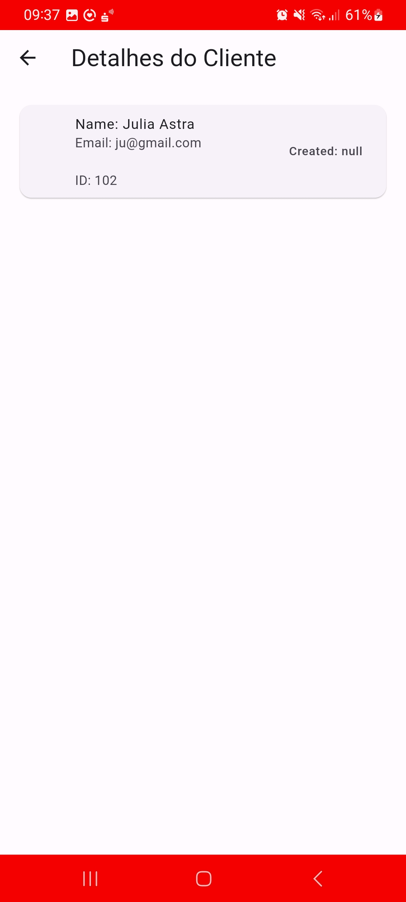
  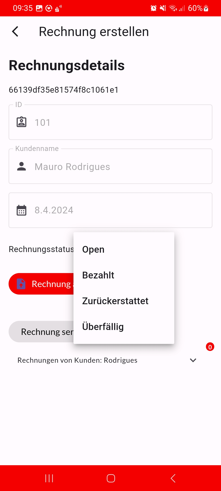
  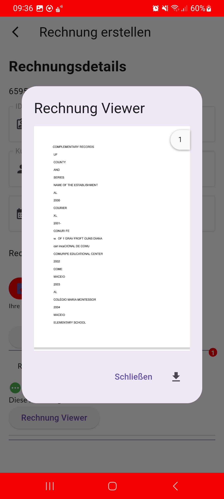
  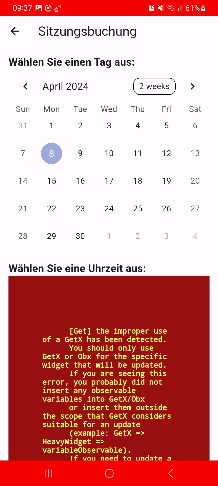
  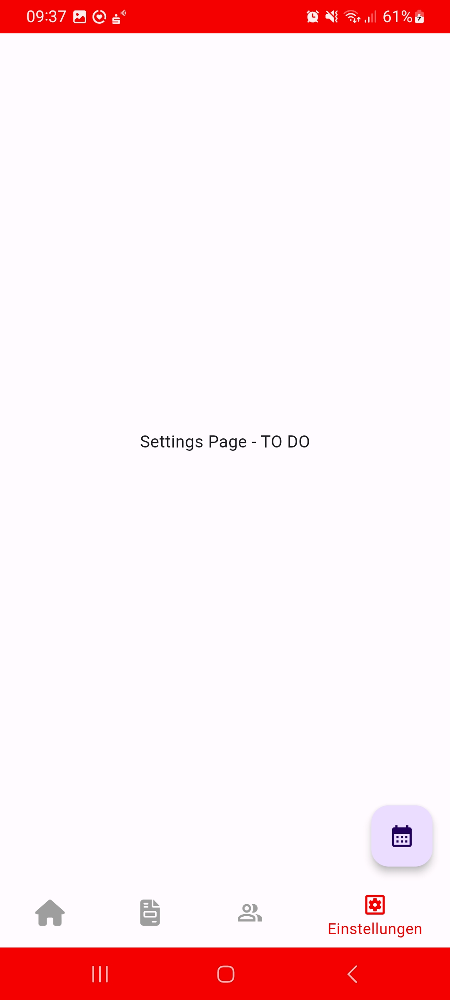

  <!-- Add more images as needed -->

